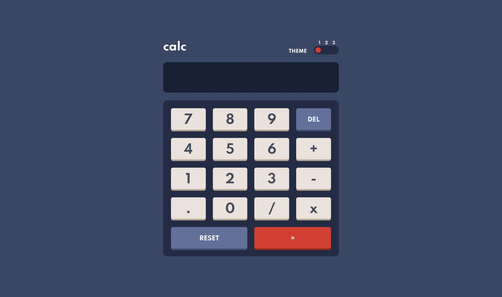

# Frontend Mentor - Calculator app solution

This is a solution to the [Calculator app challenge on Frontend Mentor](https://www.frontendmentor.io/challenges/calculator-app-9lteq5N29). Frontend Mentor challenges help you improve your coding skills by building realistic projects.

## Table of contents

- [Overview](#overview)
  - [The challenge](#the-challenge)
  - [Screenshot](#screenshot)
  - [Links](#links)
- [Built with](#built-with)
- [Author](#author)

## Overview

### The challenge

Users should be able to:

- See the size of the elements adjust based on their device's screen size
- Perform mathmatical operations like addition, subtraction, multiplication, and division
- Adjust the color theme based on their preference
- **Bonus**: Have their initial theme preference checked using `prefers-color-scheme` and have any additional changes saved in the browser

### Screenshot

### Links

- [Solution](https://www.frontendmentor.io/solutions/calculator-app-with-theme-switch-using-css-variables-and-vue-9WAtBhAZu)
- [Live Site](https://calculator-app-black-tau.vercel.app/)

## Built with

- CSS variables
- Mobile-first workflow
- BEM Methodology
- [VueJS](https://vuejs.org/) - JS Framework
- [Sass](https://sass-lang.com/) - CSS Preprocessor
- [Pug](https://pugjs.org/) - HTML Preprocessor

## Author

- Frontend Mentor - [@BrandonSdvl](https://www.frontendmentor.io/profile/BrandonSdvl)
- Github - [@BrandonSdvl](https://github.com/BrandonSdvl)
